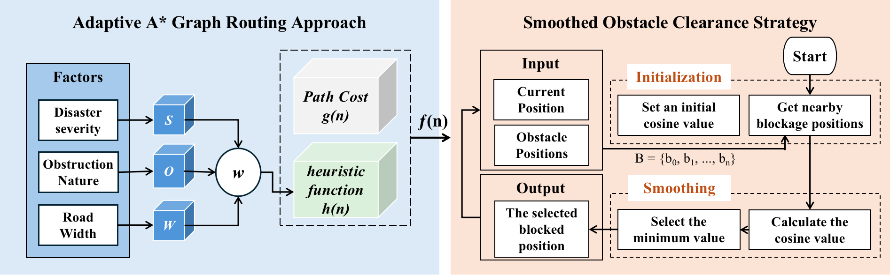

# `AA*-SOC` Adaptive A* Graph Routing Approach with Smoothed Obstacle Clearance Strategy
AA*-SOC is a novel framework proposed for police to enhance the effectiveness of rescue operations during natural disasters. By leveraging an innovative algorithm and strategy, this framework aims to optimize police route selection and obstacle clearance, and ultimately improve the overall rescue efforts in disaster-stricken areas.

## Introduction
Natural disasters like fires, earthquakes, and hurricanes inflict substantial human and economic losses. A crucial aspect in mitigating these losses lies in police efforts to clear blockades and, in so doing, allow other rescue personnel to move efficiently around the scene. Such police actions substantially impact the overall. To improve the effectiveness of disaster rescue, we develop the AA*-SOC framework for police to simulate multi-agent rescue missions in disaster situations using the RoboCupRescue Simulation (RCRS) system.

## Framework


The figure illustrates the AA*-SOC framework for increasing the efficiency of police rescue missions. 
  1. AA*-SOC framework employs an Adaptive A* graph routing (AA*) approach that considers the severity of the disaster, the nature of any obstacles, and the road conditions to adaptively optimise route selection for blockage search in different disaster environments. This allows police to conduct blockage searches more effectively and efficiently.
  2. The framework incorporates a Smoothed Obstacle Clearance (SOC) strategy, which guides police to clear obstacles in “smoothed directions” as determined by minimum angle rather than shortest distance. This strategy can quickly establish passable roads for evacuation and rescue. 

## Experiment
Two representative region maps were used for the rescue scenarios: San Francisco and Silicon Valley. 

### Performance Evaluation
The proposed framework (AA*-SOC) yields superior outcomes and performance, outperforming all baseline methods in rescue simulation.

As shown in Table,  AA*-SOC's final scores surpass all baselines in all regions.
| Method | Dijkstra_RCR   | A*_RCR   | A*_Random   | AA*_SOC   |
|------------|------------|------------|------------|------------|
| San Francisco | 99.17 | 99.21 | 98.65 | **103.30** |
| Silicon Valley | 250.98 | 252.38 | 251.58 | **263.37** |

<p align="center">
  
</p>

As shown in the final rescue scenarios, the blocked roads of AA*-SOC are both less than the baselines in San Francisco and Silicon Valley.
<p align="center">
  
</p>

## Running
### 1. Software Pre-Requisites
```
Git
Gradle
OpenJDK Java 8+
```

### 2. Compile the project

Open a terminal window, navigate to the ```rcrs-server-1.5``` root directory
```bash
$ ./gradlew clean completeBuild
```

Open another terminal window, navigate to the ```AA*-SOC``` root directory
```bash
$ ./gradlew clean build
```

### 3. Execute the project

Open the terminal window of the ```rcrs-server-1.5``` root directory and execute
```bash
$ cd boot
$ ./start.sh -m ../maps/gml/vc/map -c ../maps/gml/vc/config
```
- `vc` is short for Silicon Valley region, which can be changed to use another map.
- `sf` is short for San Francisco region.

Open the terminal window of the ```AA*-SOC``` root directory and execute
```bash
$ ./launch.sh -all
```

After all codes are complete, click on the platform‘s `run` button.

## Support

To report a bug, suggest improvements or request support, please open an issue at GitHub <https://github.com/KeevaLyu/AA--SOC-Framework/issues>.
